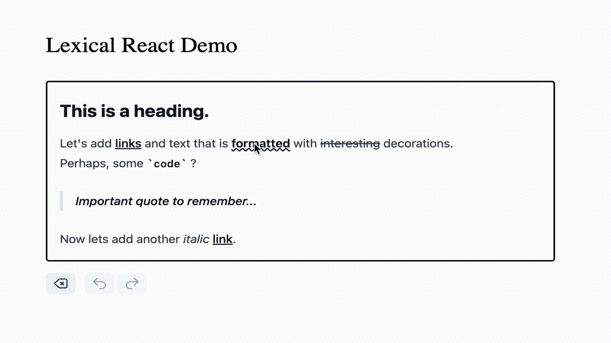

# 🌬️ lexical-floating-menu

#### Designed for `@lexical/react`. Headless & fully customizable.

Improve your text editing experience with an intuitive floating menu / bubble menu.

📌 Live Demo: [lexical-floating-menu.vercel.app](https://lexical-floating-menu.vercel.app/)

📌 Blog Post: _tba_

---



---

## Getting Started

#### Install

```bash
npm install lexical-floating-menu
```

Note: Make sure you have all [peer dependencies](https://github.com/konstantinmuenster/lexical-floating-menu/blob/main/package.json#L45) installed.

#### Configure

`lexical-floating-menu` exports a React component that can be included as a plugin within your editor.

```tsx
import { FloatingMenuPlugin } from "lexical-floating-menu";
import { YourFloatingMenuUI } from "../components/FloatingMenu";

export function LexicalEditor(props: LexicalEditorProps) {
  return (
    <LexicalComposer initialConfig={props.config}>
      {/** ... other plugins (e.g. RichTextPlugin) */}
      <FloatingMenuPlugin
        // This component represents the rendered menu. You can include any formatting
        // options. FloatingMenuPlugin takes care of rendering it at the right position.
        MenuComponent={YourFloatingMenuUI}
        // optional – Define to which HTML element the menu gets appended to
        element={document.body}
      />
    </LexicalComposer>
  );
}
```

Take a look at the [Storybook example](https://github.com/konstantinmuenster/lexical-floating-menu/blob/main/stories/FloatingMenuPlugin.stories.ts) to see how your FloatingMenu component could look like.

---

## About

<a href="https://www.buymeacoffee.com/kmuenster" target="_blank"></a>

Konstantin Münster – [konstantin.digital](https://konstantin.digital)

Distributed under the [MIT](http://showalicense.com/?fullname=Konstantin+M%C3%BCnster&year=2019#license-mit) license.
See `LICENSE` for more information.

[https://github.com/konstantinmuenster](https://github.com/konstantinmuenster)
